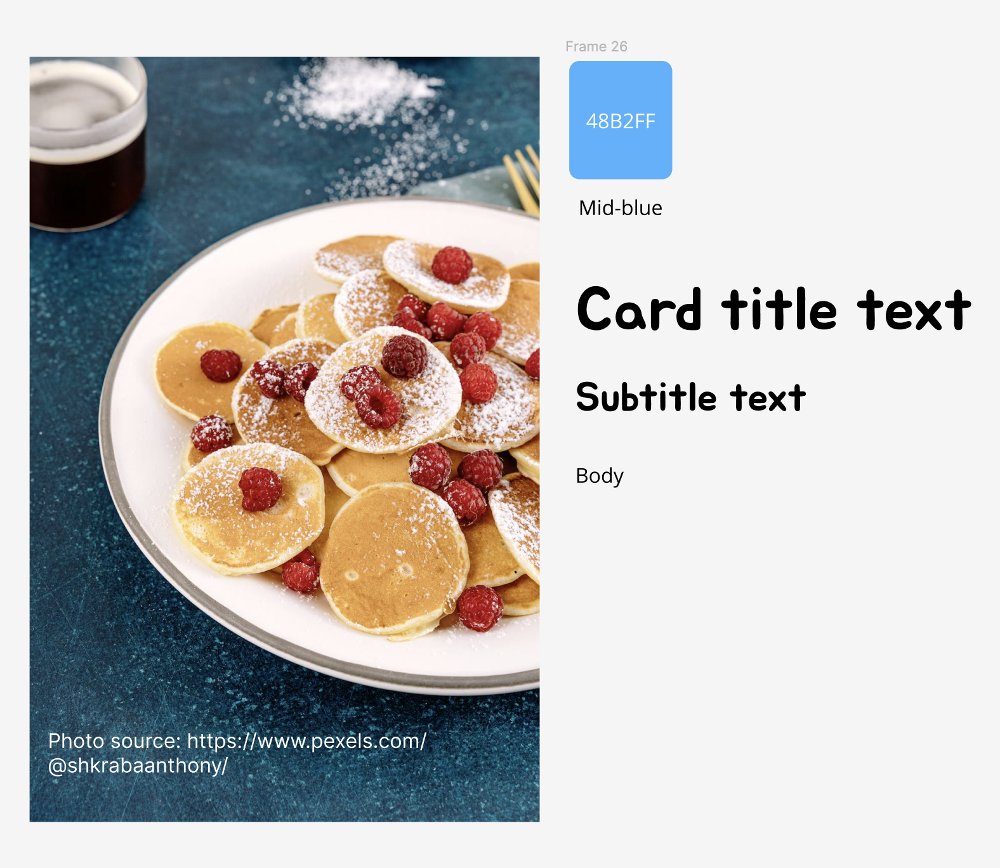
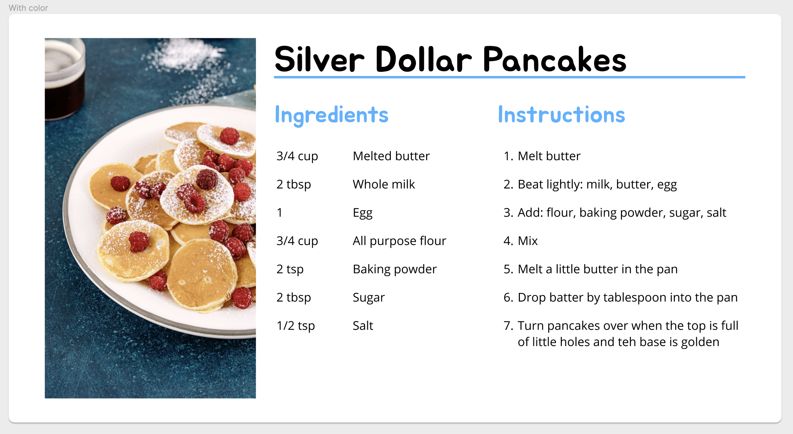
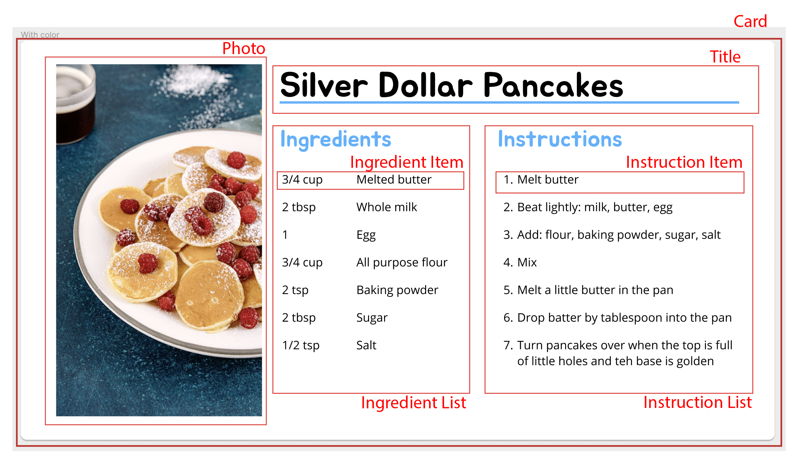

# Hello React!

Today we will be creating a new blank React project with Webpack and Babel. Before we dive in, lets run through some helpful terminology.

## Node Setup

Before we begin, lets first check to make sure we have node installed.

In terminal enter:

```bash
node -v
```

If a version is returned, you're all set!

If not, go to https://nodejs.org/en/download and download the appropriate installer and install node on your machine.

# Create React Project

We will be using Create React to create a new empty project.

```bash
npx create-react-app hello-react
```

This will take a few seconds to spin up our new project. Once this is done, lets change directories into our new project folder:

```bash
cd /hello-react
```

To run our project dev server at any time run

```bash
npm start
```

Our brand new project will launch in the browser at `localhost:3000`.

To cancel/stop the dev server enter `control + c`

Lets take a look at the files in the project we just created. Most of these are for templating purposes so we can delete them and create our own starter app.js.

Files we will keep:

`index.html`: Our nearly empty HTML skeleton page where we load index.js and grab the `#root` div to load our React project

`index.js`: The js file that loads and executes when our app starts up

`package.json` and `package-lock.json`: A list of dependecies our app needs in order to run. These files will update as we install more dependencies via `npm`.

`node-modules`: A directory containing all of the dependencies we installed.

---

Lets delete everything else and create our own `index.js`

Inside index.js we will enter a few notes and a few lines of code to get our app up and running again!

First, we need to import React and ReactDOM libraries before we use them:

```js
import React from 'react'
import ReactDOM from 'react-dom/client
```

_note: ReactDOM is for loading elements in a web browser, our other option here for mobile would be ReactNative_

Now, we grab and store the root div element and tell React to take control of it:

```js
const el = document.getElementById('root')

const root = ReactDOM.createRoot(el)
```

Finally we create an app component and render/display it on the screen:

```js
function App() {
  return <h1>Hello World!</h1>
}

root.render(<App />)
```

## HTML to JSX and Componentization

Today we are going in inspect a simple design for a recipe card made in Figma. Break the design into atomic components and styles and then load the content from data. Lets get started!

First, lets view and discuss a few designs/layouts:
[Simple Recipe Card](https://www.figma.com/file/oPToKD0BEwCUQFt3OjCDw6/RecipeCardStarter?type=design&node-id=2%3A134&mode=dev)

Morgan, our designer was kind enough to call out our font and color variables for clarification. We will revisit these once we add our CSS.



Now lets take a look at a desktop layout for our recipe card. We could make this one giant component, and load all of the recipe info including the image via some JSON, but that wouldnt make any of our work very reusable would it?



We can quickly mark this up and visualize our atomic components and thier parent/child relationships:



Our final goal is for our components to break down into something like this in our project:

```
<Card>
  <RecipeImg />
  <RecipeTitle />
  <IngredientList>
    <IngredientItem/>
    <IngredientItem/>
    <IngredientItem/>
  </IngredientList>
  <InstructionList>
    <InstructionItem/>
    <InstructionItem/>
    <InstructionItem/>
  </InstructionList>
</Card>
```

We might need to pepper in a few extra jsx elements for layout purposes once we start styling, but for now this is basically how our components will nest.

## In Class Exercise 1: HTML to JSX

Create a new create-react-project for todays exercise.

```bash
npx create-react-app recipe-card
cd recipe-card
npm start
```

Be sure to clear out all of the starter files expect our index.html and index.js!

Now we are going to split our App component out from our index.js. We do this by:

- Create an `App.js` file
- Make an App component that returns JSX
- Export that component
- Import our App component to index.js
- Use our `<App />` component in index.js

index.js:

```jsx
import React from 'react'
import ReactDOM from 'react-dom/client'
import App from './App'

const root = ReactDOM.createRoot(document.getElementById('root'))
root.render(
  <React.StrictMode>
    <App />
  </React.StrictMode>
)
```

App.js

```jsx
import React from 'react'

function App() {
  return <div>Hello App!</div>
}

export default App
```

After we take a moment together to create a RecipeCard component and import and use it in App.js (We are going to keep our top level app component as clear as possible for now), take a momment to port your HTML recipe HW into your RecipeCard component code.

- Make a folder called `/assets` for you image
- make a folder titled `RecipeCard`
- Create an ` index.js`` file inside  `RecipeCard/` and create your component there.
- to import an image from assets:

```jsx
import RECIPE_IMG from '../assets/pancake.png'
```

- to use that image:

```jsx

```

## In Class Exercise 2: Rendering content from data

Now that we have a component rendering our hardcoded recipe, lets take a second to create a recipe object so that we can render our recipe from data instead of hardcoding it in our JSX. Lets name that file `recipe-data.js` and save it inside of our `RecipeCard/` directory.

When you are finished you should have something resembling:

```js
export const RECIPE = {
  title: 'Buttermilk Pancakes',
  imgSrc: require('../assets/pancake.png'),
  description:
    'Some sort of lovely description about the best buttermilk pancakes in the world.',
  ingredients: [
    '3/4 cup Melted butter',
    '2 tbsp Whole milk',
    '1 Egg',
    '3/4 cup All purpose flour',
    '2 tsp Baking powder',
    '2 tbsp Sugar',
    '1/2 tsp Salt',
  ],
  instructions: [
    'Melt butter',
    'Beat lightly: milk, butter, egg',
    'Add: flour, baking powder, sugar, salt',
    'Mix',
    'Melt a little butter in the pan',
    'Drop batter by tablespoon into the pan',
    'Turn pancakes over when the top is full of little holes and teh base is golden',
  ],
}
```

Now that we have the data let's import and use it in our `RecipeCard` component.

```jsx
import {RECIPE} from './recipe-data'
```

example usage:

```jsx
      
     <h1>{RECIPE.title}</h1>
```

_note: you'll have to map through the arrays of ingredients and instructions in order for them to render as individual `<li>`_

Woo Hoo! We are now rendering all of our recipe info from a data file. In the future we can trade recipes with fellow students as long as we keep the exact same data format.

## In Class Exercise 3: Breaking up our <RecipeCard /> into atomic components

As exiting as it is to have all of our info rendering based on data, our RecipeCard file is still bloated and could be broken down further into smaller more atomic components.

Remember this diagram?

Lets break out the InstructionsList together.

lets create a new component at the bottom of our file (for now)

```jsx
function InstructionsList(props) {
  const {instructions} = props
  return (
    <div>
      <h3>Instructions</h3>
      <ol>
        {instructions.map((i, index) => (
          <li key={index}>{i}</li>
        ))}
      </ol>
    </div>
  )
}
```

and now use it inside our `RecipeCard`

```jsx
...
<InstructionsList instructions={RECIPE.instructions} />
```

You'll notice this is our first instance of using `props` for a component. After we discuss for a few minutes in class take a moment to break down our RecipeCard into individual components.
